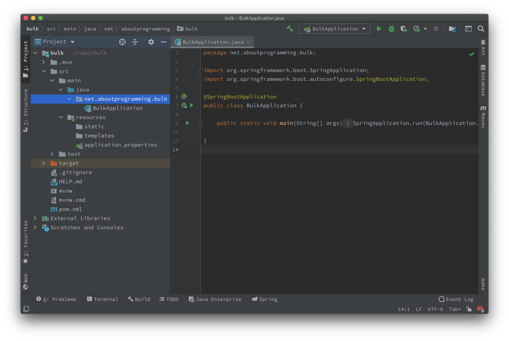

# [编程这点事](https://aboutprogramming.net)

您好，欢迎来到**编程这点事**站点。扫码关注公众号获取更多精彩内容。

关注并发编程、分布式编程、微服务架构等领域。内容起于编程而不止于编程。

## 创建第一个Spring Boot项目

1. 访问 Spring Boot 官方的项目初始化工具：[https://start.spring.io/](https://start.spring.io/)

2. 选择相应的构建工具、语言、SpringBoot版本等信息，如下图所示：

   	

   > 当前项目只选择了`spring-boot-starter-web`依赖包。

3. 点击下方的 **GENERATE** 按钮会自动开始生成项目并下载到本地

4. 将下载好的项目 `zip` 包解压，并使用 **IDEA Open Or Import** 功能打开项目

   

5. 项目结构如下所示
    )

6. 下载示例代码：[https://github.com/aboutprogramming/bulk/releases/tag/v0.1.0](https://github.com/aboutprogramming/bulk/releases/tag/v0.1.0)